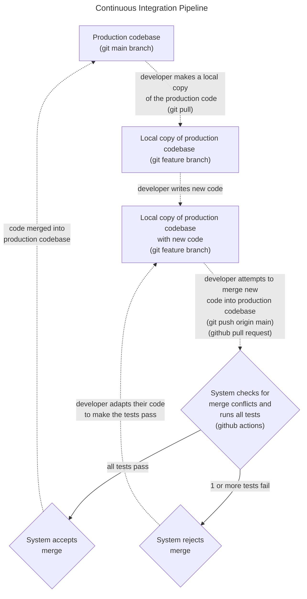

# python-github-ci-pipeline

This [GitHub](https://github.com) repo holds an example [Continuous Integration (CI)](https://en.wikipedia.org/wiki/Continuous_integration) pipeline for a python project, built using [GitHub actions](https://github.com/features/actions) and [GitHub branch protection rules](https://docs.github.com/en/repositories/configuring-branches-and-merges-in-your-repository/managing-protected-branches/about-protected-branches). A tutorial blog post explaining this repo in detail can be found [here](./blog_post/tutorial.md).

The python project code in this repo is an implementation of the original 
[Diffie-Hellman-Merkle Key Exchange](https://en.wikipedia.org/wiki/Diffie-Hellman_key_exchange#Cryptographic_explanation) 
algorithm. You can see the project documentation [here](https://J-sephB-lt-n.github.io/python-github-ci-pipeline/) (this documentation is automatically built by the [CI](https://en.wikipedia.org/wiki/Continuous_integration) pipeline when a pull request to main branch is accepted).

<< **this repo is still under construction** >>

This flowchart illustrates the [CI](https://en.wikipedia.org/wiki/Continuous_integration) pipeline implemented in this git repo:



Parts of the [CI](https://en.wikipedia.org/wiki/Continuous_integration) pipeline can be run locally using the [Makefile](./Makefile) in terminal using the following commands: 

```bash
# install all of the python packages required in order to contribute to this python project #
make install_dev_dependencies

# install all of the python packages required in order to use this python project (i.e. as an end-user) #
make install_prod_dependencies

# run all tests (unit, integration, end-to-end, test coverage, linter, type-checking, docstring examples) #
make run_all_tests

# quantify test coverage #
make test_coverage

# run all unit tests # 
make unit_tests

# run all integration tests #
make integration_tests

# run all end-to-end tests #
make end_to_end_tests

# run code linter (static code analysis) #
make linter

# run type-checks (static code type-checking) #
make type_checks

# verify python code examples in function/method docstrings #
make check_docstring_example_code

# automatically format all scripts (uses Ruff) #
make auto_format_full_codebase

# locally host the project documentation #
make view_docs_local

# locally build the documentation and push it to GitHub pages #
make deploy_docs_to_github
```

The project code consists of a toy implementation of the original [Diffie-Hellman-Merkle Key Exchange](https://en.wikipedia.org/wiki/Diffie–Hellman_key_exchange) algorithm (which is used to securely communicate a secret key across an insecure public communication channel).  

This [CI](https://en.wikipedia.org/wiki/Continuous_integration) pipeline works as follows (joe TODO: references in text below are stale after last refactor):

* The pipeline is set up as a single GitHub action (I've labelled the action "**ci**" on the GitHub repo).

* Users are not allowed to push directly the **main** branch of the repository - they must merge a feature branch into **main** using a [pull request](https://en.wikipedia.org/wiki/Distributed_version_control#Pull_requests).

* [Pull requests](https://en.wikipedia.org/wiki/Distributed_version_control#Pull_requests) to **main** branch trigger the **ci** GitHub action to run, and the merge to **main** is rejected if any one of the steps in **ci** reports an error. 

* You can read the code defining the **ci** pipeline GitHub action in this repo here: [.github/workflows/ci.yml](./.github/workflows/ci.yml)

Implemented so far:

| Task                        | Location                | How to Run This Task
|-----------------------------|-------------------------|-----------------------------
| Auto-format all code scripts (uses [Ruff](https://github.com/astral-sh/ruff)) | local github repo | run in terminal (from project root folder):<br> <code>make auto_format_code</code>
| Auto-format all code scripts (uses [Ruff](https://github.com/astral-sh/ruff)) | remote github repo      | task runs automatically (using github action) whenever code is pushed to remote main branch
| Install development dependencies (required to run tests, build documentation etc.) | local github repo | run in terminal (from project root folder):<br> <code>make install_dev_dependencies</code>
| Install production dependencies (required to use the package) | local github repo | run in terminal (from project root folder):<br> <code>make install_prod_dependencies</code>
| Measure test coverage (uses [pytest-cov](https://github.com/pytest-dev/pytest-cov)) | local github repo | run in terminal (from project root folder):<br> <code>make test_coverage</code>
| Run all tests (unit, integration, end-to-end, test coverage, linter, type-checking) | local github repo | run in terminal (from project root folder):<br> <code>make run_all_tests</code>
| Run all unit tests | local github repo | run in terminal (from project root folder):<br> <code>make unit_tests</code>
| Run all integration tests | local github repo | run in terminal (from project root folder):<br> <code>make integration_tests</code>
| Run all end-to-end tests | local github repo | run in terminal (from project root folder):<br> <code>make end_to_end_tests</code>
| Run code linting on core scripts in [/diffie_hellman_merkle/](./diffie_hellman_merkle/) folder (uses [Pylint](https://github.com/pylint-dev/pylint)) | local github repo | run in terminal (from project root folder):<br> <code>make linter</code>
| Run static type checking on core scripts in [/diffie_hellman_merkle/](./diffie_hellman_merkle/) folder (uses [my[py]](https://github.com/python/mypy)) | local github repo | run in terminal (from project root folder):<br> <code>make type_checks</code>

# GitHub Actions and Branch Protection Rules

* Branch protection is set up on the main branch (on the GitHub website UI under *Settings>>Code and automation>>Branches>>Branch protection rules*) as follows:

    - Branch name pattern: *main*
    
    - ☑ Require status checks to pass before merging: **ci**

    - ☑ Do not allow bypassing the above settings (i.e. repository administrators must follow the rules too)

# Setup Notes

* In order for GitHub actions to be able to write to the repository (e.g. to automatically format code, and then commit and push the changed code), you need to enable "Read and write permissions" for GitHub actions in the GitHub website UI (this is under *Settings>>Actions>>General*).

# Other Notes

* Remote rejections can be pre-empted by developers using [pre-commit](https://github.com/pre-commit/pre-commit) locally, which will cause commits of insufficient quality (e.g. mypy errors, pylint score too low etc.) to be rejected locally when a local <code>git commit</code> is attempted (i.e. before attempting communication with the remote github repository). However, this puts the onus on individual developers to be principled with their local environment, which is why I used GitHub branch protection rules on the remote repository instead (so that the remote main branch is automatically protected).

# Some Useful Resources 

* https://www.wolframalpha.com (for finding large prime numbers, and finding/verifying primitive roots)

* https://docs.github.com/en/actions/automating-builds-and-tests/building-and-testing-python

* https://github.com/marketplace/actions/github-push

* https://www.math.stonybrook.edu/~sorin/311-2006/hw8.pdf
