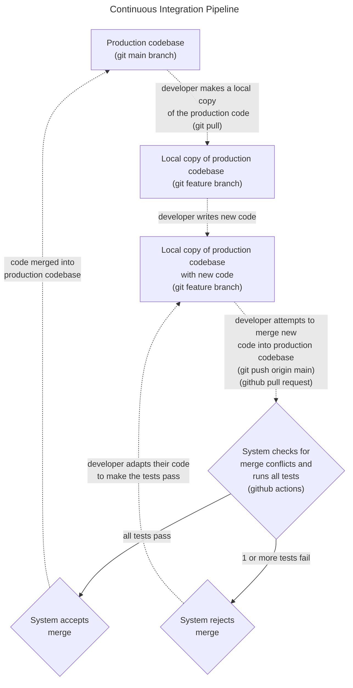

# Tutorial: How to Build a Continuous Integration Pipeline using GitHub Actions

!!This tutorial is still under heavy construction!!

A working version of the CI pipeline described in this tutorial is available in the public github repository https://github.com/J-sephB-lt-n/python-github-ci-pipeline (you can fork this repo and try it out for yourself). Everything will work even if you are using a free GitHub account, as long as your fork is a public repository. 

## Contents 

* [What is CI/CD and Why Would We Want It?](#what-is-cicd-and-why-would-we-want-it)

* [Prerequisite Knowledge](#prerequisite-knowledge)

* [What You Will Learn in this Tutorial](#what-you-will-learn-in-this-tutorial)

* [A Quick Intro to the Core Tools](#a-quick-intro-to-the-core-tools)

* [CI Pipeline in GitHub](#ci-pipeline-in-github)

    - [How it Looks](#ci-pipeline-in-github-how-it-looks)

    - [How to Build It](#ci-pipeline-in-github-how-to-build-it)

* [Next Steps](#next-steps)

## What is CI/CD and Why Would We Want It?

[CI/CD](https://en.wikipedia.org/wiki/CI/CD) stands for [Continuous Integration / Continuous Delivery](https://en.wikipedia.org/wiki/CI/CD). It is a [Dev-Ops](https://en.wikipedia.org/wiki/DevOps) software development style which is designed to make the process of releasing software updates as fast and as seamless as possible. 

It consists of two distinct parts:

| Software Development Practice | Basic Idea
|-------------------------------|--------------------------------------------------------------------------------------------------------------------------------
| <a id=ci>Continuous Integration</a> (CI)   | Developers working on the same project merge their new code into the central shared code base very frequently (typically at least once per day)  i.e. code contributions by team members are integrated into the production code base continuously.
| <a id=cd>Continuous Delivery</a> (CD)      | Production software builds are released very frequently   i.e. user-facing software updates are released almost continuously.

In order to release stable and trustworthy software, a lot of quality and stress testing is required, and both continuous [integation](#c1) and [delivery](#cd) achieve this by automating all of these tests.

This tutorial demonstrates how an automated [Continuous Integration](https://en.wikipedia.org/wiki/Continuous_integration) process can be set up in [GitHub](https://github.com) using [GitHub Actions](https://docs.github.com/en/actions). Again, you can see the working code [here](https://github.com/J-sephB-lt-n/python-github-ci-pipeline).

## Prerequisite Knowledge

This tutorial assumes that you have a rudimentary understanding of the version control system [git](https://git-scm.com), specifically these concepts:

* local and remote repositories 

* development branches 

* git merge

* git pull

* git push

* pull request

If you've never heard any of these terms before, I would recommend reading an introductory article on git ([this one](https://dev.to/ionos/an-introduction-to-git-the-basics-every-beginning-developer-should-know-o62) is not bad).  

## What You Will Learn in this Tutorial
In this tutorial, we're building a CI pipeline using [GitHub Actions](https://docs.github.com/en/actions). The reasons that I chose to use the enterprise platform [GitHub](https://github.com/) for this are:

1. [GitHub](https://github.com/) has a generous free tier (i.e. you can do a lot without having to pay anything)

2. All of the biggest python libraries host their source code on [GitHub](https://github.com/). Examples are [Requests](https://github.com/psf/requests), [Flask](https://github.com/pallets/flask/), [FastAPI](https://github.com/tiangolo/fastapi), [mypy](https://github.com/python/mypy), [Numpy](https://github.com/numpy/numpy), [Pandas](https://github.com/pandas-dev/pandas), [PyTorch](https://github.com/pytorch/pytorch), [TensorFlow](https://github.com/tensorflow/tensorflow), [SciKit-Learn](https://github.com/scikit-learn/scikit-learn), [matplotlib](https://github.com/matplotlib/matplotlib), [SQLAlchemy](https://github.com/sqlalchemy/sqlalchemy) etc. etc. etc. (even [python itself](https://github.com/python/cpython))

This flowchart illustrates the core behaviour of the CI pipeline which we will be implementing (using [github actions](https://docs.github.com/en/actions)) in this tutorial:

## A Quick Intro to the Core Tools

Although not the focus of this tutorial, here is a short description of all of the tools you'll be exposed to in this tutorial: 

| Tool                         | Description
|------------------------------|-------------------
| [Git](https://git-scm.com/)  | The most widely used version control system for managing codebases. [Git](https://git-scm.com/) keeps a full history of every change made to the code, and makes it easy to explore this history. [Git](https://git-scm.com/) is also very good at merging the work of multiple authors on the same file (and elegantly resolving their conflicts).    
| [GitHub](https://github.com/)|
| [GitHub Actions and Branch Protection Rules](#github-actions-and-branch-protection-rules) | 
| [PyTest](#pytest) | 
| [MkDocs and MkDocStrings (Documentation)](#mkdocs-and-mkdocstrings-documentation) | 
| [Ruff (Code Formatter)](#ruff-code-formatter) | 
| [MyPy (Type Checking)](#mypy-type-checking) | 
| [PyLint (Code Analyser)](#pylint-code-analyser) | 

## CI Pipeline in GitHub

### CI Pipeline in GitHub: How it Looks

### CI Pipeline in GitHub: How to Build It

## Next Steps
