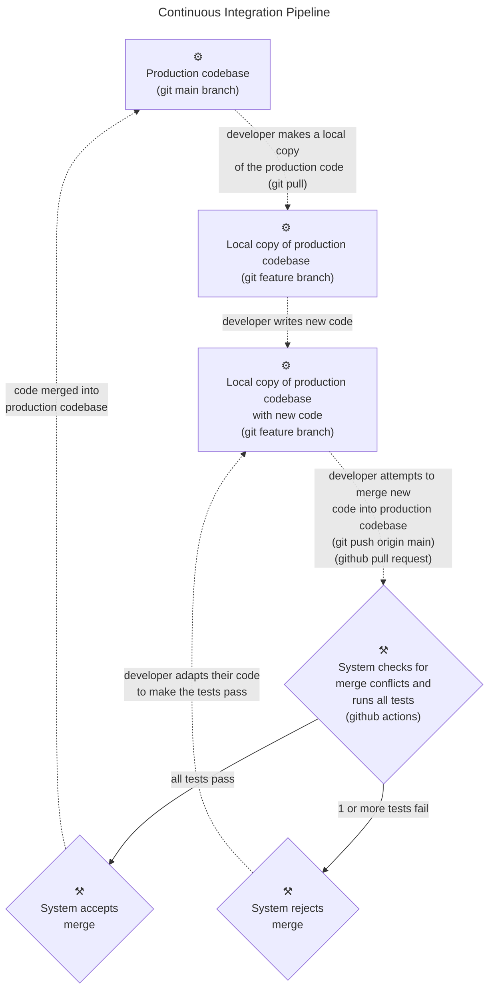

# Tutorial: Continuous Integration Pipeline using GitHub

!!This tutorial is still under heavy construction!!

A working version of the CI pipeline described in this tutorial is available in the public github repository https://github.com/J-sephB-lt-n/python-github-ci-pipeline (you can fork this repo and try it out for yourself). Everything will work even if you are using a free GitHub account, as long as your fork is a public repository. 

## Contents 

* [What is CI/CD and Why Would We Want It?](#what-is-cicd-and-why-would-we-want-it)

* [Prerequisite Knowledge](#prerequisite-knowledge)

* [What You Will Learn in this Tutorial](#what-you-will-learn-in-this-tutorial)

* [A Quick Intro to the Core Tools](#a-quick-intro-to-the-core-tools)

    - [Git and GitHub (Version Control)](#git-and-github-version-control)

    - [GitHub Actions and Branch Protection Rules](#github-actions-and-branch-protection-rules)

    - [PyTest](#pytest)

    - [MkDocs and MkDocStrings (Documentation)](#mkdocs-and-mkdocstrings-documentation)

    - [Ruff (Code Formatter)](#ruff-code-formatter)

    - [MyPy (Type Checking)](#mypy-type-checking)

    - [PyLint (Code Analyser)](#pylint-code-analyser)

* [CI Pipeline in GitHub](#ci-pipeline-in-github)

    - [How it Looks](#ci-pipeline-in-github-how-it-looks)

    - [How to Build It](#ci-pipeline-in-github-how-to-build-it)

* [Next Steps](#next-steps)

## What is CI/CD and Why Would We Want It?

[CI/CD](https://en.wikipedia.org/wiki/CI/CD) stands for [Continuous Integration / Continuous Delivery](https://en.wikipedia.org/wiki/CI/CD). It is a [Dev-Ops](https://en.wikipedia.org/wiki/DevOps) software development style which is designed to make the process of releasing software updates as fast and seamless as possible. 

It consists of two distinct parts:

| Software Development Practice | Basic Idea
|-------------------------------|--------------------------------------------------------------------------------------------------------------------------------
| <a id=ci>Continuous Integration</a> (CI)   | Developers working on the same project merge their changes into the shared code base very frequently (typically at least once per day)  i.e. code contributions by team members are integrated into the working code base continuously.
| <a id=cd>Continuous Delivery</a> (CD)      | Production software builds are released very frequently   i.e. user-facing software updates are released almost continuously.

In order to release stable and trustworthy software, a lot of quality and stress testing is required, and both continuous [integation](#c1) and [delivery](#cd) achieve this by automating all of these tests.

This tutorial demonstrates how an automated [Continuous Integration](https://en.wikipedia.org/wiki/Continuous_integration) process can be set up in [GitHub](https://github.com). Again, you can see the working code [here](https://github.com/J-sephB-lt-n/python-github-ci-pipeline).

## Prerequisite Knowledge

This tutorial assumes that you have a rudimentary understanding of the version control system [git](https://git-scm.com), specifically these concepts:

* git pull

* git push

* git merge

* pull request

## What You Will Learn in this Tutorial
This flowchart illustrates the core behaviour of the CI pipeline which we will be implementing (using [github actions](https://docs.github.com/en/actions)) in this tutorial:

## A Quick Intro to the Core Tools

## A Quick Intro to the Core Tools: Git and GitHub (Version Control)

## A Quick Intro to the Core Tools: GitHub Actions and Branch Protection Rules

## A Quick Intro to the Core Tools: PyTest

## A Quick Intro to the Core Tools: MkDocs and MkDocStrings (Documentation)

## A Quick Intro to the Core Tools: Ruff (Code Formatter)

## A Quick Intro to the Core Tools: MyPy (Type Checking)

## A Quick Intro to the Core Tools: PyLint (Code Analyser)

## CI Pipeline in GitHub

### CI Pipeline in GitHub: How it Looks

### CI Pipeline in GitHub: How to Build It

## Next Steps